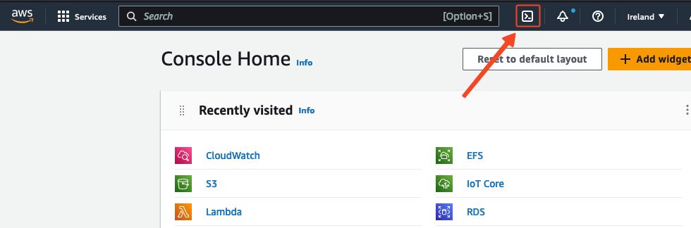

Easily decode barcodes and QR codes at scale with AWS Lambda!
With this Lambda Function you will be able to add decoding features to your applications at scale!

### What do I need?
**AWS Account** If you don't already have an account or you have not been handed one as part of a workshop, please visit the following [link](https://portal.aws.amazon.com/billing/signup?nc2=h_ct&src=header_signup&redirect_url=https%3A%2F%2Faws.amazon.com%2Fregistration-confirmation#/start)! 

### How can I read QR codes with AWS Lambda?

#### Step 1. Create an Amazon S3 bucket. 
* **You will need to have an Amazon S3 Bucket created.**
* **You will need to create a folder inside that bucket, where you will upload your images to decode.(Optional)**

#### Step 2, Generate code artifacts and dependencies
To read QR/Barcodes, we are going to be using the [Zbar library](https://github.com/mchehab/zbar), an open source software suite for reading bar codes. We are going to include Zbar and other necessary packages into Lambda Layers for our Lambda function to work.
But don't worry, we have already automated this process for you, in a simple script you can run in your AWS Cloudshell! Here are the steps you have to follow:

* Access AWS CloudShell, a browser-based shell inside the AWS console. You can click the terminal icon next to the search bar or looking for _Cloudshell_ in the service search bar.

* Once CloudShell has initiallized, clone this repo 
   * `git clone https://github.com/Consoneo/Barcode-QR-Decoder-Lambda.git`

* Run the `setup.sh` script in order to generate the needed lambda layers and code package. You must specify the bucket where you want to upload this artifacts replacing <BUCKET_NAME> with the S3 bucket name you created.
   * `sh Barcode-QR-Decoder-Lambda/src/code/setup.sh -b <BUCKET_NAME>`

* Once the script finishes, you should see 3 new files in your S3 bucket under `BarcodeQRDecoder/qr-reader/assets/` path, the two Lambda layers containing the libraries needed (Pillow and Pyzbar) and the lambda code packaged in a .zip file

#### Step 3, Create your Lambda function

* Create a new Lambda Function.
* Select Author from scratch.
* Input a new name for your function
* Select Python 3.10 as runtime
* Select x86_64 as architecture
* Create a new role with basic Lambda permissions
* Replace the code with Python code inside `code/lambda.py`
* Add envirroement variables :
   - DB_USER
   - DB_PASSWORD
   - DB_HOST
   - DB_DATABASE

You have now created the Lambda function!

#### Step 4, Add Layers to your Lambda function
As we mentioned before, your function needs some packages to run correctly. If you completed step 2, you should have the layers artifacts ready in your bucket!
Follow these steps to create your layers:
  - Open the Layers page of the Lambda console. 
  - Choose Create layer.
  - Under Layer configuration, for Name, enter a name for your layer.
  - (Optional) For Description, enter a description for your layer.
  - To upload a file from Amazon S3, choose Upload a file from Amazon S3. Then, for Amazon S3 link URL, enter the S3 URI of the artifact.
  - For Compatible architectures, choose x86_64.
  - For Compatible runtimes, choose Python 3.10.
  - Choose Create.

Repeat these steps for both artifacts created in S3.

Next, go to the Lambda function and in your layers section, select Add Layer. Select your layers which will be available at the Custom AWS layers dropdown.

#### Step 5, Configure the permissions needed
Head over to IAM and add permissions to your associated role to access your S3 Bucket.

You can find your role in the Configuration --> Permissions tab in the function editor.

Also, increase your lambda timeout to 60 seconds in the function configuration.

#### Step 6, Configure your Amazon S3 Trigger event
* Once you open your new Lambda Function, head over to the **Function overview** panel and click on **Add trigger**.

  

* Select **S3** from the trigger list.
* Select the S3 bucket where you will be uploading your files.
* Select **All object create events**.
* If you want to add prefix to specify a folder you can also add it.

  

* Once you have configured all parameters, **Add** the trigger. 

 

#### Step 7, Try out your Lambda Function
You are now ready to add Barcode/QR code decoding capabilities to your applications at scale!
Simply add an image with a QR to your S3 bucket folder you specified earlier. 
You can see the logs your lambda function returns in the CloudWatch Logs console.

## Security

See [CONTRIBUTING](CONTRIBUTING.md#security-issue-notifications) for more information.

## License

This library is licensed under the MIT-0 License. See the LICENSE file.

